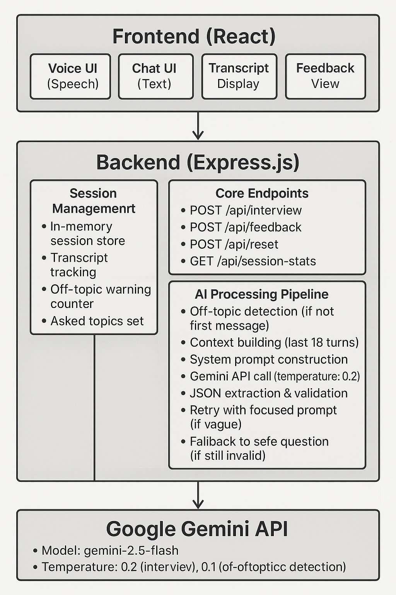

# AI Interview Coach

An AI-powered voice interview practice platform that conducts realistic mock interviews with intelligent follow-up questions, persona adaptation, and comprehensive feedback.

---

## Features

### Multi-Persona Support
- **Efficient User**: Concise, direct responses with quick-paced questions
- **Confused User**: Patient guidance with clarifying questions and examples
- **Chatty User**: Polite redirection when responses become lengthy
- **Edge Case User**: Handles off-topic/invalid inputs with professional boundaries

### Off-Topic Detection
- AI-powered relevance checking using Google Gemini
- 3-strike warning system (gentle → firm → final)
- Visual warning banners with escalating severity
- Tracked in final feedback for performance analysis

### Intelligent Interview Flow
- Context-aware follow-up questions (no generic "tell me more")
- Entity extraction (technologies, metrics, projects mentioned)
- Avoids repetition by tracking covered topics
- Natural conversation progression

### Voice & Text Input
- Real-time speech recognition (Web Speech API)
- Text-to-speech interviewer responses
- Dual input modes (voice + text simultaneously)
- Audio toggle control

### Comprehensive Feedback
- Overall performance summary
- Scored ratings: Communication (/10), Technical Depth (/10), Problem-Solving (/10)
- Persona-specific advice
- 5-8 concrete improvement tips
- Strengths analysis
- Off-topic warning impact

### Supported Roles
Software Engineer, Product Manager, Sales Representative, Data Scientist, UX Designer, Marketing Manager, Retail Associate

---

## Architecture

### System Architecture Diagram


```


┌─────────────────────────────────────────────────────────────┐
│                      Frontend (React)                        │
│  ┌────────────┬──────────────┬────────────┬───────────────┐ │
│  │  Voice UI  │   Chat UI    │ Transcript │   Feedback    │ │
│  │ (Speech)   │   (Text)     │   Display  │    View       │ │
│  └────────────┴──────────────┴────────────┴───────────────┘ │
│         │              │              │            │         │
│         └──────────────┴──────────────┴────────────┘         │
│                        │ REST API                            │
└────────────────────────┼─────────────────────────────────────┘
                         │
                         ▼
┌─────────────────────────────────────────────────────────────┐
│                   Backend (Express.js)                       │
│  ┌──────────────────────────────────────────────────────┐   │
│  │              Session Management                       │   │
│  │  • In-memory session store                          │   │
│  │  • Transcript tracking                              │   │
│  │  • Off-topic warning counter                        │   │
│  │  • Asked topics set                                 │   │
│  └──────────────────────────────────────────────────────┘   │
│  ┌──────────────────────────────────────────────────────┐   │
│  │              Core Endpoints                          │   │
│  │  • POST /api/interview  - Conduct interview         │   │
│  │  • POST /api/feedback   - Generate feedback         │   │
│  │  • POST /api/reset      - Reset session             │   │
│  │  • GET  /api/session-stats - Get statistics         │   │
│  └──────────────────────────────────────────────────────┘   │
│  ┌──────────────────────────────────────────────────────┐   │
│  │           AI Processing Pipeline                     │   │
│  │  1. Off-topic detection (if not first message)      │   │
│  │  2. Context building (last 18 turns)               │   │
│  │  3. System prompt construction                      │   │
│  │  4. Gemini API call (temperature: 0.2)             │   │
│  │  5. JSON extraction & validation                    │   │
│  │  6. Retry with focused prompt (if vague)           │   │
│  │  7. Fallback to safe question (if still invalid)   │   │
│  └──────────────────────────────────────────────────────┘   │
└────────────────────────┬─────────────────────────────────────┘
                         │
                         ▼
┌─────────────────────────────────────────────────────────────┐
│                   Google Gemini API                          │
│  • Model: gemini-2.5-flash                                  │
│  • Temperature: 0.2 (interview), 0.1 (off-topic detection) │
│  • Structured JSON output                                    │
└─────────────────────────────────────────────────────────────┘
```

### System Design

### Tech Stack

**Frontend:**
- React 18 with Hooks
- Vite build tool
- Tailwind CSS
- Lucide React icons
- Web Speech API

**Backend:**
- Node.js + Express
- Google Gemini API (gemini-2.5-flash)
- In-memory session management
- CORS enabled

### Data Flow Diagram

```
User speaks/types
      │
      ▼
Frontend captures input
      │
      ▼
POST /api/interview
      │
      ▼
┌─────────────────────┐
│ Off-topic detection?│
└─────────────────────┘
      │
      ├─ Yes: Return warning → User receives warning banner
      │                        (Strike 1/2/3)
      │
      └─ No: Continue
            │
            ▼
      Build context from transcript
      (Last 18 conversation turns)
            │
            ▼
      Generate system prompt
      (with persona guidelines)
            │
            ▼
      Call Gemini API
      (temperature: 0.2)
            │
            ▼
      ┌─────────────────────┐
      │  Extract JSON       │
      │  - reply            │
      │  - follow_ups       │
      │  - reason           │
      └─────────────────────┘
            │
            ├─ Valid & Specific → Use response
            │
            ├─ Vague → Retry with entity-focused prompt
            │          (Extract tech terms, metrics)
            │
            └─ Invalid → Use safe fallback question
                  │
                  ▼
            Store in session transcript
                  │
                  ▼
            Return to frontend
                  │
                  ▼
            Display in UI + Speak via TTS
```

### API Endpoints

**POST /api/interview**
- Conducts interview conversation
- Returns: `{ reply, follow_ups, reason, off_topic_warning, warning_count }`

**POST /api/feedback**
- Generates comprehensive feedback
- Returns: `{ feedback, off_topic_count }`

**POST /api/reset**
- Resets interview session
- Returns: `{ ok: true }`

**GET /api/session-stats/:sessionId**
- Returns session statistics
- Returns: `{ message_count, off_topic_warnings, config, topics_covered }`

---

## Design Decisions

### 1. AI-Powered Off-Topic Detection
**Why**: Keyword matching creates false positives. AI understands context and nuance.
**How**: Separate Gemini call with temperature 0.1, confidence threshold >0.7

### 2. Progressive Warning System (3 strikes)
**Why**: Single warning too harsh, unlimited tolerance defeats purpose
**Impact**: Fair chances while maintaining boundaries

### 3. Dynamic Persona Adaptation
**Why**: Different users need different interview styles for realistic experience
**How**: System prompt modifications based on selected persona

### 4. Retry Mechanism for Vague Responses
**Why**: AI occasionally produces generic responses
**How**: Detect vague text → Extract entities → Retry with focused prompt → Safe fallback if still vague

### 5. In-Memory Sessions
**Why**: Fast prototyping without database overhead
**Trade-off**: Sessions lost on restart (acceptable for demo, needs DB for production)

### 6. Voice + Text Hybrid
**Why**: Voice preferred but not always practical (environment, accessibility)
**Impact**: Seamless switching between input modes

### 7. Independent Transcript Scrolling
**Why**: Long interviews need reference without losing controls visibility
**UX**: Separate panel with auto-scroll, controls remain fixed

### 8. Structured JSON Output
**Why**: Enables extraction of follow-ups, reasoning, and programmatic parsing
**Challenge**: Multiple extraction strategies (direct parse, regex, fallback)

### 9. Low Temperature (0.2 interview, 0.1 detection)
**Why**: Consistency and professionalism over creativity
**Result**: Predictable, relevant, professional responses

### 10. Transcript Truncation (18 turns)
**Why**: Manage token limits while maintaining context
**Impact**: Keeps API calls efficient

---

## Setup Instructions

### Prerequisites
- Node.js v18+
- npm or yarn
- Google Gemini API Key ([Get it here](https://makersuite.google.com/app/apikey))
- Chrome/Edge browser (for voice features)

### Backend Setup

1. Navigate to backend:
```bash
cd backend
```

2. Install dependencies:
```bash
npm install
```

3. Create `.env` file:
```bash
touch .env
```

4. Add to `.env`:
```env
GEMINI_API_KEY=your_api_key_here
PORT=5000
```

5. Start server:
```bash
npm start
```

Expected output: `Backend running on port 5000`

### Frontend Setup

1. Navigate to frontend (new terminal):
```bash
cd frontend
```

2. Install dependencies:
```bash
npm install
```

3. Start dev server:
```bash
npm run dev
```

Expected output: `Local: http://localhost:5173/`

4. Open browser: `http://localhost:5173/`

### Verify Setup
- Backend: `http://localhost:5000` running
- Frontend: Browser shows AI Interview Coach interface
- Test: Start interview, speak/type answer, receive follow-up

---

## Usage

### Starting Interview
1. Select role, experience level, and persona
2. Click "Start Mock Interview"
3. Answer questions via voice (click mic) or text
4. Monitor transcript in right panel
5. End interview with phone button
6. Review feedback

### Testing Personas

**Efficient User:**
```
Q: Tell me about a recent project.
A: Built payment API with 99.9% uptime using Node.js and Redis.
Q: What specifically did Redis handle?
```

**Confused User:**
```
Q: Describe your microservices experience.
A: What exactly do you mean by microservices?
Q: Let me clarify - have you worked with distributed systems?
```

**Chatty User:**
```
Q: Tell me about a challenge.
A: So I was working on this project in 2020 and my manager...
Q: Can you focus on the specific technical challenge you solved?
```

**Edge Case User:**
```
Q: What's your database experience?
A: What's the weather like?
Q: [WARNING] Stay focused: What's your database experience?
```

---

## Project Structure

```
AI AGENT FINAL/
├── backend/
│   ├── node_modules/
│   ├── .env                 # API keys (don't commit)
│   ├── package.json
│   ├── package-lock.json
│   └── server.js            # Express server + AI logic
│
├── frontend/
│   ├── node_modules/
│   ├── public/
│   ├── src/
│   │   ├── assets/
│   │   ├── App.jsx          # Main React component
│   │   ├── App.css
│   │   ├── main.jsx         # Entry point
│   │   └── index.css
│   ├── index.html
│   ├── package.json
│   ├── tailwind.config.js
│   └── vite.config.js
│
└── README.md
```

---

## Troubleshooting

**Backend won't start:**
- Check `.env` file exists with valid `GEMINI_API_KEY`
- Verify port 5000 is available

**Frontend connection failed:**
- Ensure backend running on port 5000
- Check browser console for CORS errors

**Voice not working:**
- Use Chrome or Edge browser
- Grant microphone permissions (click lock icon in address bar)
- Use text input as fallback

**Off-topic detection not working:**
- Requires at least 2 messages in conversation
- Check backend logs for detection results

---

## Evaluation Criteria Alignment

✅ **Conversational Quality**: Natural follow-ups, professional tone, handles ambiguity  
✅ **Agentic Behavior**: Dynamic question generation, persona adaptation, off-topic handling  
✅ **Technical Implementation**: Clean architecture, robust error handling, production-quality code  
✅ **Intelligence & Adaptability**: Context-aware questioning, entity extraction, progressive warnings

---

## Known Limitations

- Sessions cleared on server restart (in-memory storage)
- Voice features require Chrome/Edge
- Gemini API rate limits apply
- Transcript truncated to last 18 turns
- Single-server architecture

---

## Future Enhancements

- Database persistence (PostgreSQL)
- User authentication and profiles
- Interview history tracking
- PDF transcript export
- Multi-language support
- Company-specific interview prep
- Real-time sentiment analysis

---

## Author

Anubhav Kushagra
GitHub: https://github.com/anubhavkushagra/interview-ai-agent  


---

## License

Educational project for AI agent assignment submission.

---

**Built with Google Gemini AI • React • Express.js**
